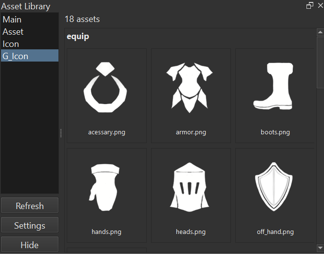

# Krita Asset Library



Krita Docker plugin for browsing asset folders and opening `.kra`, `.png`, `.jpg`, and `.jpeg` files as new Krita documents.

## Features

- Register multiple asset folder paths from the Docker settings dialog.
- Set an optional alias for each path. When set, the alias is shown in the left folder list.
- Change registered asset path order with Up/Down buttons in Settings.
- Enable `IncludeSubFolder` per asset path to include files from child folders.
- Displays thumbnails for PNG/JPG files and KRA previews when `preview.png` or `mergedimage.png` exists in the KRA archive.
- Right-click an asset thumbnail or filename to open the context menu:
  - `open`: open as a new Krita document.
  - `rename`: rename the asset file.
  - `remove`: delete the asset file after confirmation.
- Left panel contains `Refresh`, `Settings`, and `Hide` / `Show` buttons.
- `Hide` collapses the right asset thumbnail container and shrinks the Docker; `Show` restores it.


## Config

Config is saved as `config.json` under `../../krita_asset_library` relative to the plugin package.

In a normal Krita install, this resolves to:
```text
%APPDATA%/krita/krita_asset_library/config.json
```